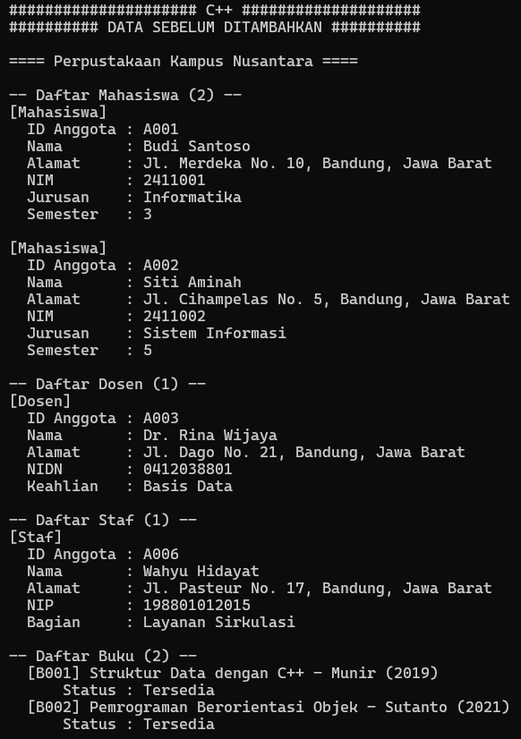
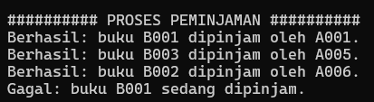
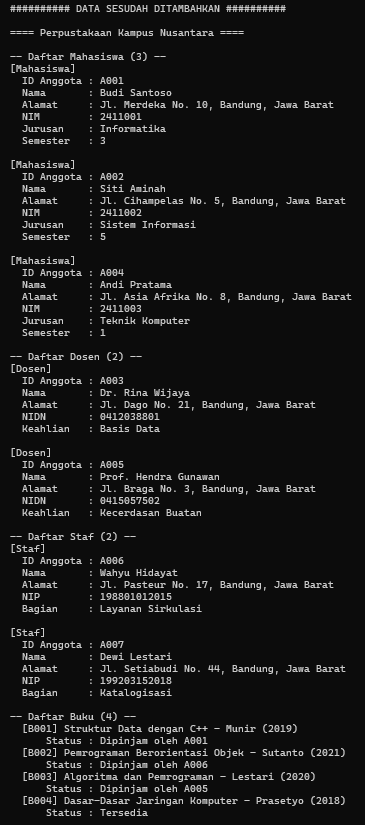
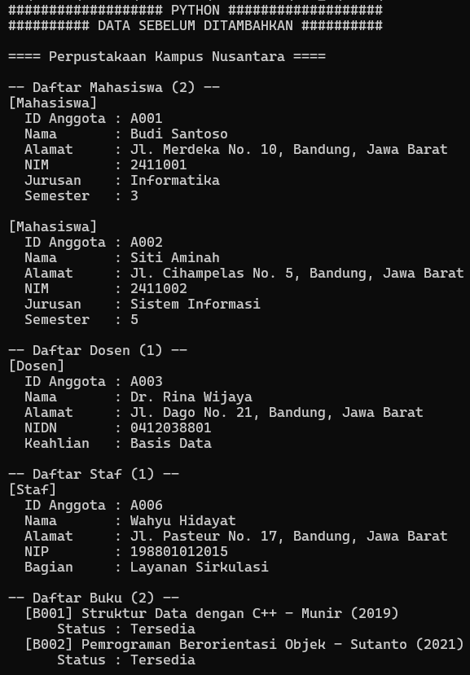
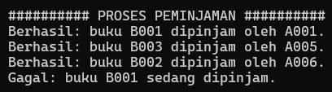

# JANJI

Saya Novelio Yeheskiel Kapahang dengan NIM 2503048 mengerjakan TP 3 dalam mata kuliah Desain Dan Pemrograman Berorientasi Objek untuk keberkahanNya maka saya tidak melakukan kecurangan seperti yang telah dispesifikasikan. Aamiin

# Sistem Perpustakaan (OOP C++ & Python)

Program sederhana untuk mengelola data **anggota perpustakaan** (mahasiswa, dosen, & staf) dan **buku**, termasuk proses peminjaman. Dibuat dalam dua bahasa (C++ dan Python) dengan desain yang sama.

Konsep OOP yang diimplementasikan:

1. **Composition**: `Anggota` memiliki `Alamat`; `Perpustakaan` memiliki `Buku`, `Mahasiswa`, dan `Dosen`.
2. **Array of object**: `vector` di C++ dan `list` di Python.
3. **Hierarchical Inheritance**: `Mahasiswa`, `Dosen`, dan `Staf` sama-sama turunan dari `Anggota`.

Semua atribut bersifat **private** (tidak ada `protected`), dan method bersifat **public**. Di Python, atribut private memakai awalan `__`.


## 1. Diagram Program


## 2. Atribut dan Method Setiap Kelas

### Alamat
Menyimpan data alamat tempat tinggal anggota.

| Atribut | Keterangan |
|---|---|
| `jalan` | Nama jalan dan nomor |
| `kota` | Kota |
| `provinsi` | Provinsi |

| Method | Keterangan |
|---|---|
| `getAlamatLengkap()` | Mengembalikan alamat dalam satu string: `jalan, kota, provinsi` |

### Anggota (base class)
Menyimpan data umum yang dimiliki semua anggota perpustakaan. Atributnya private, sehingga kelas turunan mengaksesnya lewat getter.

| Atribut | Keterangan |
|---|---|
| `idAnggota` | ID unik anggota (mis. `A001`) |
| `nama` | Nama anggota |
| `alamat` | Objek `Alamat` (composition) |

| Method | Keterangan |
|---|---|
| `getId()` | Mengembalikan ID anggota |
| `getNama()` | Mengembalikan nama anggota |
| `getAlamat()` | Mengembalikan objek `Alamat` milik anggota |
| `tampilkanInfo()` | Mencetak ID, nama, dan alamat |

### Mahasiswa (turunan Anggota)
Atribut tambahan khusus mahasiswa.

| Atribut | Keterangan |
|---|---|
| `nim` | Nomor induk mahasiswa |
| `jurusan` | Jurusan/program studi |
| `semester` | Semester berjalan |

| Method | Keterangan |
|---|---|
| `tampilkanInfo()` | Mencetak label `[Mahasiswa]`, memanggil `tampilkanInfo()` milik `Anggota`, lalu mencetak NIM, jurusan, semester |

### Dosen (turunan Anggota)
Atribut tambahan khusus dosen.

| Atribut | Keterangan |
|---|---|
| `nidn` | Nomor induk dosen nasional |
| `bidangKeahlian` | Bidang keahlian dosen |

| Method | Keterangan |
|---|---|
| `tampilkanInfo()` | Mencetak label `[Dosen]`, memanggil `tampilkanInfo()` milik `Anggota`, lalu mencetak NIDN dan keahlian |

### Staf (turunan Anggota)
Atribut tambahan khusus staf perpustakaan.

| Atribut | Keterangan |
|---|---|
| `nip` | Nomor induk pegawai |
| `bagian` | Bagian/unit kerja (mis. Layanan Sirkulasi) |

| Method | Keterangan |
|---|---|
| `tampilkanInfo()` | Mencetak label `[Staf]`, memanggil `tampilkanInfo()` milik `Anggota`, lalu mencetak NIP dan bagian |

### Buku
Menyimpan data satu buku beserta status peminjamannya.

| Atribut | Keterangan |
|---|---|
| `kode` | Kode unik buku (mis. `B001`) |
| `judul` | Judul buku |
| `penulis` | Nama penulis |
| `tahunTerbit` | Tahun terbit |
| `idPeminjam` | ID anggota yang meminjam. Bernilai `"-"` jika buku tersedia |

| Method | Keterangan |
|---|---|
| `getKode()` | Mengembalikan kode buku |
| `isDipinjam()` | `true` jika `idPeminjam` bukan `"-"` |
| `pinjam(id)` | Menandai buku dipinjam oleh anggota `id` |
| `kembalikan()` | Mengembalikan status buku menjadi tersedia |
| `tampilkanInfo()` | Mencetak data buku dan statusnya |

### Perpustakaan
Kelas pengelola yang menyimpan seluruh data.

| Atribut | Keterangan |
|---|---|
| `nama` | Nama perpustakaan |
| `daftarBuku` | Array of object `Buku` |
| `daftarMahasiswa` | Array of object `Mahasiswa` |
| `daftarDosen` | Array of object `Dosen` |
| `daftarStaf` | Array of object `Staf` |

| Method | Keterangan |
|---|---|
| `tambahBuku(b)` | Menambah buku ke `daftarBuku` |
| `tambahMahasiswa(m)` | Menambah mahasiswa ke `daftarMahasiswa` |
| `tambahDosen(d)` | Menambah dosen ke `daftarDosen` |
| `tambahStaf(s)` | Menambah staf ke `daftarStaf` |
| `anggotaTerdaftar(id)` | (private) Mengecek apakah ID ada di daftar mahasiswa, dosen, atau staf |
| `pinjamBuku(kode, id)` | Memproses peminjaman. Gagal jika anggota tidak terdaftar, buku tidak ditemukan, atau buku sedang dipinjam |
| `tampilkanSemua()` | Mencetak seluruh mahasiswa, dosen, staf, dan buku |

## 3. Penjelasan Desain Program

### Hierarchical Inheritance
Program menggunakan `Anggota` sebagai **base class** yang diwariskan ke tiga class, yaitu `Mahasiswa`, `Dosen`, dan `Staf`.

```text
        Anggota
       /   |   \
Mahasiswa Dosen Staf
```

`Anggota` menyimpan data umum seperti ID, nama, dan alamat. Setiap class turunan memiliki data tambahan masing-masing:
- `Mahasiswa`: NIM, jurusan, semester.
- `Dosen`: NIDN, bidang keahlian.
- `Staf`: NIP, bagian.

Atribut dibuat **private** dan diakses melalui method yang tersedia. Constructor class turunan juga memanggil constructor `Anggota`.

### Composition
Program menggunakan hubungan **has-a**:
- `Anggota` memiliki `Alamat`.
- `Perpustakaan` memiliki kumpulan `Buku`, `Mahasiswa`, `Dosen`, dan `Staf`.

`Alamat` dibuat sebagai class terpisah agar data jalan, kota, dan provinsi lebih terorganisir.

### Array of Object
`Perpustakaan` menyimpan banyak objek menggunakan:
- C++: `vector`
- Python: `list`

Data disimpan dalam kumpulan terpisah untuk `Buku`, `Mahasiswa`, `Dosen`, dan `Staf`. Data dapat ditambahkan dan ditampilkan menggunakan perulangan.

### Data Program
Program memiliki:
- **6 data awal**: 2 mahasiswa, 1 dosen, 1 staf, dan 2 buku.
- **5 data tambahan**: 1 mahasiswa, 1 dosen, 1 staf, dan 2 buku.
- **4 percobaan peminjaman**: 3 berhasil dan 1 gagal karena buku sudah dipinjam.

Data ditampilkan sebelum dan sesudah penambahan untuk menunjukkan perubahan isi perpustakaan.

## 4. Alur Program

Program berjalan dengan alur sebagai berikut:

1. Program membuat objek `Perpustakaan` sebagai tempat menyimpan data anggota dan buku.

2. Program memasukkan **data awal**, yaitu 2 mahasiswa, 1 dosen, 1 staf, dan 2 buku. Setiap anggota juga memiliki objek `Alamat`.

3. Program menampilkan seluruh data awal menggunakan method `tampilkanSemua()`.

4. Program menambahkan **data baru**, yaitu 1 mahasiswa, 1 dosen, 1 staf, dan 2 buku.

5. Program melakukan beberapa proses peminjaman buku menggunakan method `pinjamBuku()`. Pada setiap peminjaman, program memeriksa:
   - Apakah anggota terdaftar.
   - Apakah buku ditemukan.
   - Apakah buku masih tersedia.

6. Jika semua pemeriksaan berhasil, buku dipinjam oleh anggota dan status buku berubah menjadi **dipinjam**. Jika tidak, program menampilkan pesan kegagalan sesuai penyebabnya.

7. Setelah semua proses selesai, program kembali menampilkan seluruh data menggunakan `tampilkanSemua()` sehingga dapat dilihat perubahan data setelah penambahan dan peminjaman.

8. Program selesai.

# DOKUMENTASI

## 1. C++





## 2. PYTHON



